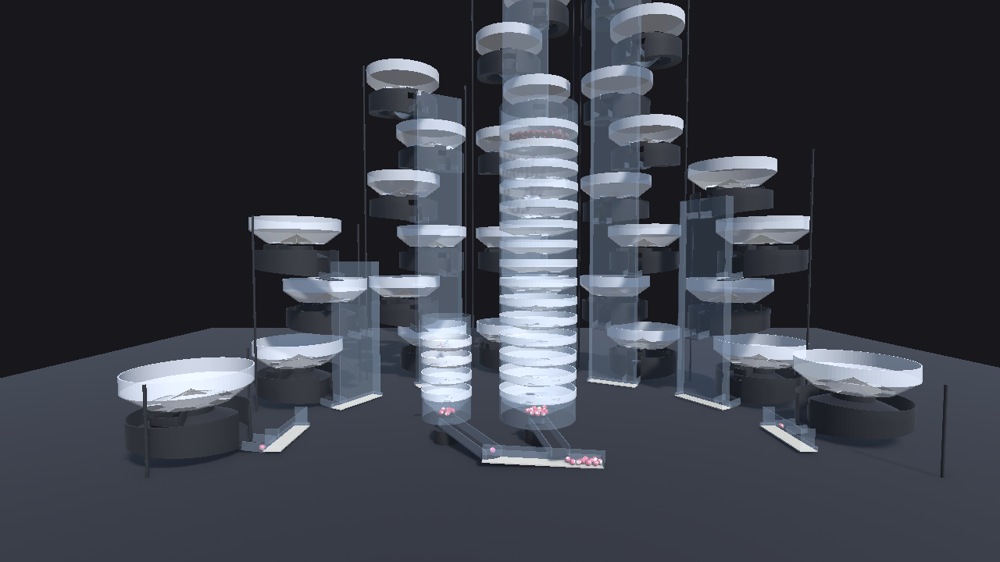
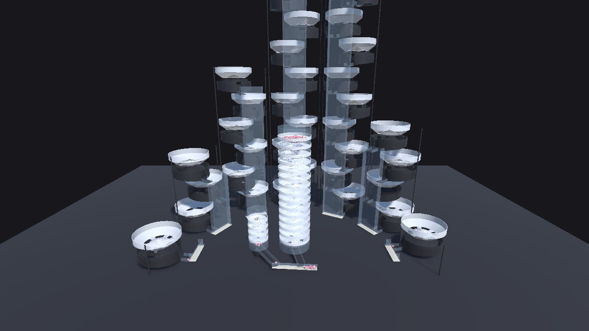
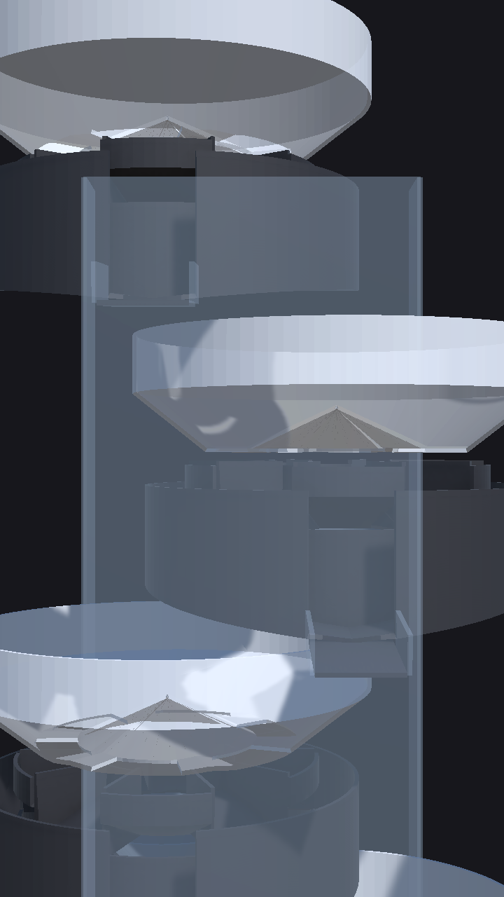
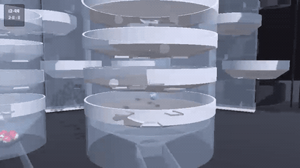
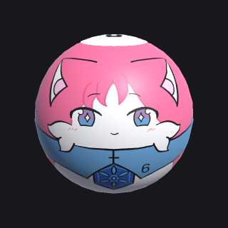
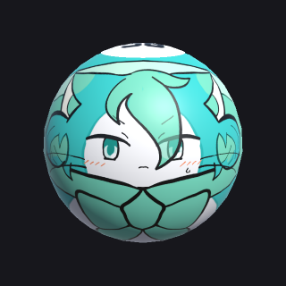
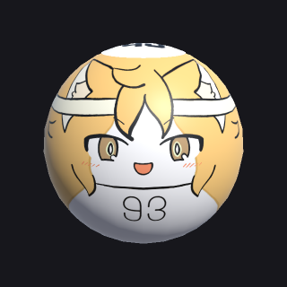
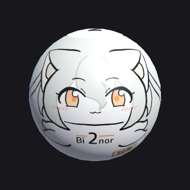

# NTsLotteryEngine

ナンバーテールズのコンテンツ用**ボール抽選機**（Unity 6 / URP）。**当選は物理が決める**（RNG で先に決めて誘導しない）。
篩型ロトマシーン 2 台と別ボール 7 塔の縦連クルーンを回し、抽選の様子を見せながら結果を JSON に書き出します。

## いまの画面

| 篩型ロトマシーン（4 層 + 15 層） | 別ボール 7 塔（弧状配置） |
| --- | --- |
|  |  |



**縦連クルーン 1 本（右）** — 回転ボウル＋静止コレクタが 11 段。球は各段で当たり扇形（軸へ）かハズレ扇形（外周の樋へ）に落ち、
落ちた瞬間の方位が当落を決めます。

抽選の様子（篩 → 塔 → 結果を 5 秒ずつ抜粋・14 秒）:



> 画像は `docs/captures/`。撮り直しは `Tools > NTsLoto > Capture Preview`（LotoScene を Play 中）と
> `Tools > NTsLoto > Capture Ball Skins`（BallViewScene を開いて）。動画は `Tools > NTsLoto > Play + Record`
> （Unity Recorder → `Recordings/*.mp4`・git 管轄外）を撮って GIF に落とす。運用は [AGENTS.md](AGENTS.md) 4 章。

<br clear="right">

## 抽選のしくみ

### 篩型ロトマシーン（`SieveMachine`）

穴のあいた回転皿を縦に重ね、球は穴を見つけるたびに下へ落ちる。**最下層の受け口に到達した順が抽選順**。

| | 球 | 層数 | 取り出す数 |
| --- | --- | --- | --- |
| 上段 | 2〜11（10 球） | 4 | 1 |
| 下段 | 12〜99（88 球） | 15 | 6 |

投入位置と番号は毎回 Fisher–Yates でシャッフルする（位置の有利不利を番号から切り離すため）。

### 縦連クルーン（`KuruunTower`）

1 段 = **回転ボウル**（穴は一様・10 rpm）＋**静止コレクタ**（当たり扇形は軸へ／ハズレ扇形は外周の樋へ）。
当たれば下段へ、外れればその場で清算。**当選率はコレクタの当たり扇形の角度比だけで作る**（コードで当たりを作らない）。

| 別ボール | 目標当選率 | 段数 | コレクタ | 実測 p（MC 10 万試行） |
| --- | --- | --- | --- | --- |
| **1** | 1/10 | 1 | `p10` | 0.1025 |
| **10** | 6/88 ≈ 0.068 | 1 | `p6of88` | 0.0688 |
| **0** | 0.10 | 3 | `p10` | 0.1025 |
| **2** | 0.50 | 10 | `p50` | 0.4980 |
| **33** | 0.53 | 11 | `p53` | 0.5311 |
| **64** | 0.32 | 6 | `p32` | 0.3187 |
| **81** | 0.18 | 4 | `p18` | 0.1818 |

- 確率の正本は `Assets/Scripts/LotoRules.cs`。実測は `Tools > NTsLoto > Monte Carlo`（`Output/mc_<variant>.json`）。
- **MC の値は「落下方位が一様」という前提の平均**。実機の落下方位は一様ではないので当たり扇形は円周に等間隔で散らしてある
  （`p18` は 3 本、`p32`/`p50`/`p53` は 5 本）。1 本 21° の下限があるため `p10` と `p6of88` は 1 本のままで偏りが残る。
  実測とのズレ・直し方は [docs/DESIGN.md](docs/DESIGN.md) 2.2。

### 出力

`result.json`（`LotoResult`）: `seed` / `drawnAt` / `single` / `six`（到達順）/ `sixSorted` / `streaks[{ball,wins,max,targetP,nameJP,nameEN}]`。

## ボールテクスチャの収録状況

球のキャラクターテクスチャは `Assets/Textures/BallSkins/BallTex_NTS-{Num_Badge}.png`（**CC BY-NC 4.0**）。
PNG を置いて `Tools > NTsLoto > Build Ball View Scene` を回すとファイル名から `Assets/Data/BallSkins.asset` に自動で紐づきます。
編集用 PSD はリポジトリに置きません（Dropbox 側で管理）。命名規約は [同フォルダの README](Assets/Textures/BallSkins/README.md)。

<!-- ballskins:start -->

**収録 8 / 106 球**（2026-09-19 時点。`Tools > NTsLoto > Capture Ball Skins` が自動更新）

| | 区分 | 番号 | Num_Badge | ファイル |
| --- | --- | --- | --- | --- |
|  | ロト | 4 | `4` | `BallTex_NTS-4.png` |
|  | ロト | 6 | `6` | `BallTex_NTS-6.png` |
|  | ロト | 50 | `50` | `BallTex_NTS-50.png` |
|  | ロト | 58 | `58` | `BallTex_NTS-58.png` |
|  | ロト | 63 | `63` | `BallTex_NTS-63.png` |
|  | ロト | 85 | `85` | `BallTex_NTS-85.png` |
|  | ロト | 93 | `93` | `BallTex_NTS-93.png` |
|  | 別ボール | 2 | `2B` | `BallTex_NTS-2B.png` |

<!-- ballskins:end -->

## リポジトリの中身

```
Assets/Scripts/            LotoRules（確率の正本）/ LotoDirector（進行）/ SieveMachine / KuruunTower /
                           BallSkinTable / CreationsDb / DerailWatch / BallTrigger / Rotator /
                           ProcMesh + TubeWall + DiscPlate（配管の生成メッシュ）/ BallSkinViewer
Assets/Scripts/Watch/      観賞ビルド NTsLotoWatch（docs/WATCH.md）: WatchDirector / WatchCoaster / WatchAudio / WatchInput / WatchBoot / TitleMenu
Assets/Scripts/Editor/     LotoSceneBuilder（シーン生成・冪等）/ BallViewSceneBuilder / WatchSceneBuilder / LotoMonteCarlo /
                           LotoPlay（+LotoPlayLoop）/ LotoRecord / LotoCapture / LotoBuild / WatchBuild / GitTools
Assets/Models/             Kuruun_Bowl / Kuruun_Collector_{p10,p18,p32,p50,p53,p6of88} / Sieve_Dish_{U,L} / Coaster_Helix（Blender 生成 FBX）
Assets/Scenes/             LotoScene（抽選本体）/ BallViewScene（ボールテクスチャ確認）/ TitleScene + WatchScene（観賞ビルド）
Assets/Resources/          SFX/（RSC の効果音・CC BY 4.0）/ Pi_RPAsset（Raspberry Pi 用 URP 設定）
Assets/Data/               BallSkins.asset（球ごとのテクスチャ + 創作DBリンク）
Assets/Textures/BallSkins/ ボールテクスチャ PNG（CC BY-NC 4.0）
Assets/Materials/Generated/ ビルダーが生成するマテリアル（Glass / Frame / Rail / Bowl / Slick）
Assets/Fonts/              PenchantManufacture.otf（HUD 用・サブモジュールから同期コピー。CJK 未収録）
BlenderSources/            gen_kuruun.py + kuruun_params.json（抽選機メッシュの原本）/ gen_coaster.py（観賞用コースター）/ Kuruun.blend
docs/                      DESIGN.md（仕様・機構の正本）/ HANDOFF.md（いまの状態）/ WATCH.md（観賞ビルドの要件）/ raspberrypi-handoff.md / captures/
scripts/                   setup-submodule.ps1 / .sh、rpi/run-loto.sh
```

生成物で git 管轄外: `Library/` `Temp/` `Logs/` `Builds/` `UserSettings/` `Recordings/` `Output/` `result*.json`。

### サブモジュール（sparse-checkout）

| パス | リポジトリ | 用途 |
| --- | --- | --- |
| `LotteryBallKit/` | [radiann-kswg/LotteryBallKit](https://github.com/radiann-kswg/LotteryBallKit) | 球（`NumberBall`）。`Packages/manifest.json` が `file:` で UPM 参照。CC BY 4.0 |
| `100BeautiesLab_CreationsDB/` | radiann-kswg/100BeautiesLab_CreationsDB | 創作DB（球のキャラ名・ロールプレイ正典）。非公開レコードは表示しない |
| `PenchantManufacture_ImageAssets/` | radiann-kswg/PenchantManufacture_ImageAssets | HUD フォント |

## 動作環境

- Unity **6000.6.0f1**（URP 17.6）
- 抽選機の形状は Blender 生成（`BlenderSources/gen_kuruun.py`）。配管（漏斗・シュート・筒・レール）は `ProcMesh` で順次 Blender 化中
- 対応プラットフォーム: Windows x64 / **Linux x64**（Raspberry Pi 4B は box64 経由。[docs/raspberrypi-handoff.md](docs/raspberrypi-handoff.md)）

## 動かしかた

1. クローン後に `scripts/setup-submodule.ps1`（または `.sh`）でサブモジュールを取得してから Unity で開く。
2. `Tools > NTsLoto > Build Loto Scene` でシーンを生成（冪等。`Assets/Scenes/LotoScene.unity`）。
3. Play。上段の篩 → 下段の篩 → 別ボール 7 塔の順に自動で進み、最後に `result.json` を書く。
4. `Tools > NTsLoto > Monte Carlo` で当選率の自己検査、`Tools > NTsLoto > Play + Record` で録画。

ビルド: `Tools > NTsLoto > Build Linux x64 (RPi)` / `Build Windows x64`。
起動引数: `-seed N` / `-out path` / `-speed x` / `-quit`。

### 観賞ビルド「NTsLotoWatch」

収録済みのボールテクスチャを 1 球ずつ転がして眺めるだけのアプリ（[docs/WATCH.md](docs/WATCH.md)）。`RasPiOS_UnityConsole`（Raspberry Pi 4B）で 30FPS を目標。
`Tools > NTsLoto > Build Watch Scene` / `Build Title Scene` でシーンを生成し、`Build Watch Linux x64 (RPi)` で `Builds/Watch/` へ。
タイトル → Watch（塔 ⇄ 螺旋コースター。LB/RB で球・X で機械・A で自動送り・Y で音・Select でヘルプ・Start/B で戻る）／ Ball View（LB/RB で球・R/A で回転）。


## ライセンス

リポジトリ既定は **CC BY-NC 4.0**（百花繚乱研究所 / ラジアン）。LotteryBallKit・RouletteSphereChaser 由来の素材は CC BY 4.0。詳細は [LICENSE.md](LICENSE.md)。
